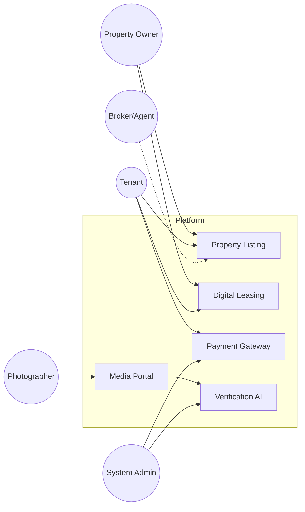
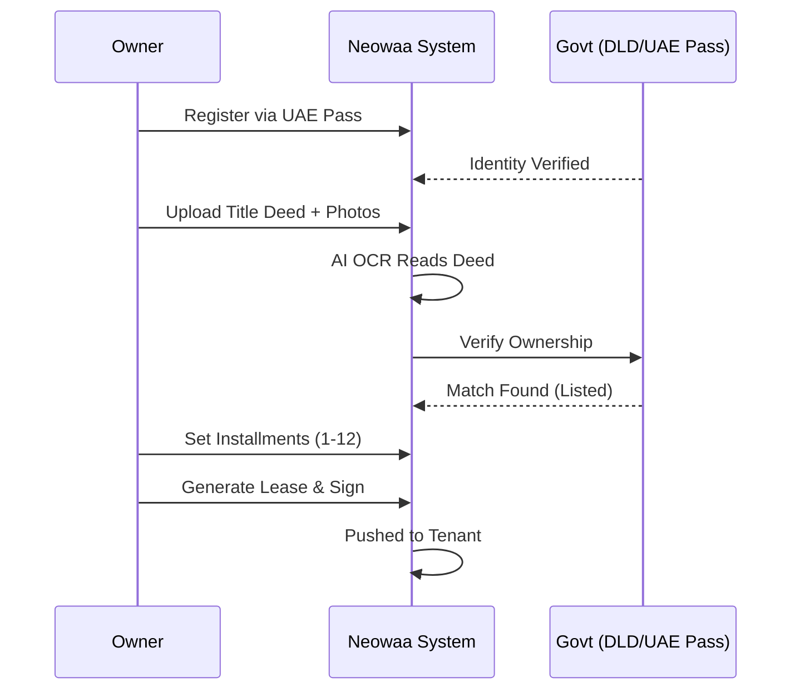
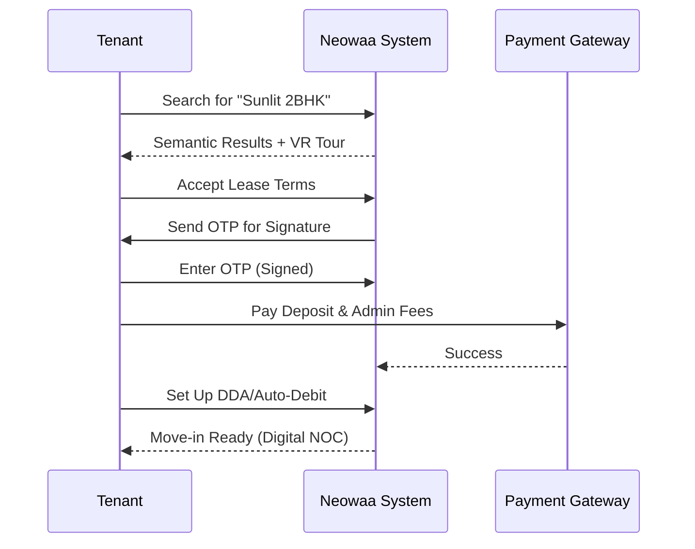
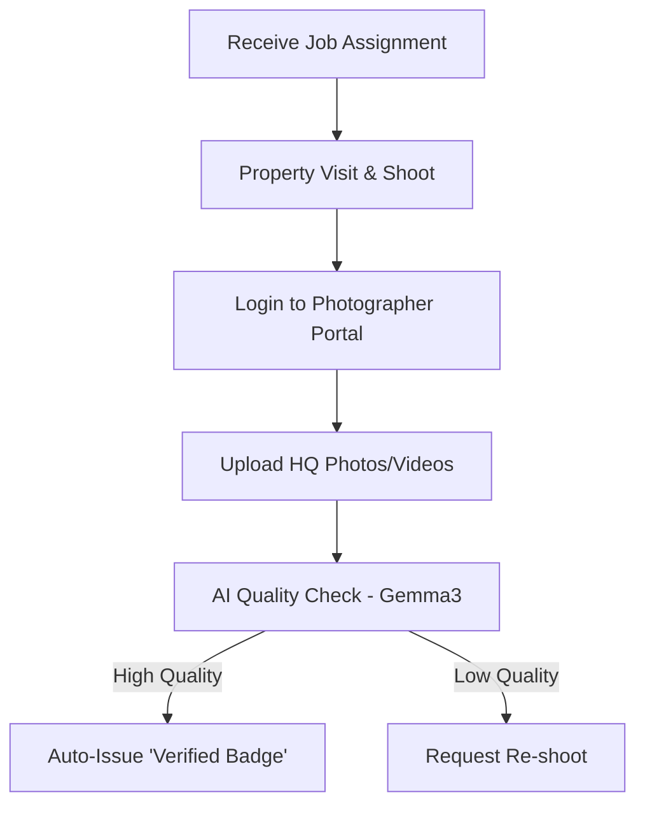
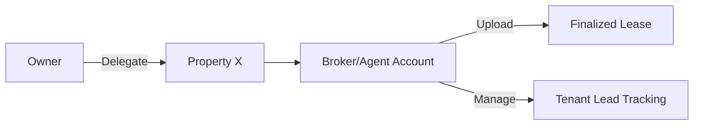

# User Roles & Persona Workflows: The Human Journey

This document explains who uses the Neowaa system and exactly how they interact with it. We use **User Flow Diagrams** to visualize the steps each person takes from start to finish.

---

## 1. High-Level Use Case (System Interaction)

This diagram shows how different users interact with the core platform services.

---

## 2. Property Owners / Landlords
Owners are focused on maximizing rental yield and minimizing management effort.

### Core Workflow:
1. **Onboarding**: Direct registration or UAE Pass.
2. **Listing**: Uploading Title Deed and property specs.
3. **Verification**: AI-driven owner/property check.
4. **Contracting**: Generating a smart lease and digital signing.

### Owner User Flow (Mermaid)

---

## 3. Tenants / Renters
Tenants look for a seamless, transparent, and legally secure search and move-in experience.

### Core Workflow:
1. **Discovery**: AI-powered "vibe" search and VR tours.
2. **Acceptance**: Digital lease review and OTP-based signature.
3. **Financials**: Paying security deposit and setting up auto-rent.
4. **Exit**: Digital move-out request and deposit recovery.

### Tenant User Flow (Mermaid)

---

## 4. Professional Photographers (Pro-Media Flow)
Photographers act as "Trust Officers" for the platform.

### Pro-Media User Flow (Mermaid)

---

## 5. Backend Administrators (Ops Layer)
Admins manage the ecosystem, resolve disputes, and ensure financial integrity.

### Admin Responsibilities:
*   **Manual KYC**: Overriding AI if document scans are unclear.
*   **Dispute Handling**: Coordinating with the **Rental Dispute Center (RDC)**.
*   **Commission Tracking**: Payouts to referral partners.

---

## 6. Brokers & Agents (Phase 2)
Agents are delegated by owners to handle specific properties.

### Agent Delegation Flow (Mermaid)

---
*Prepared by Antigravity for Lince's Understanding folder.*
